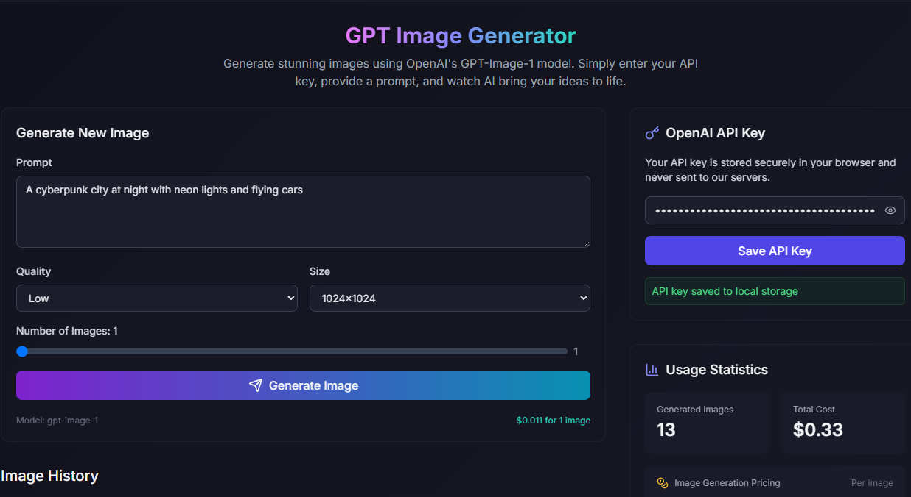

# ✨ GPT Image Generator

[](https://kit.svelte.dev/)
[](https://tailwindcss.com/)
[](https://openai.com/)
[](https://www.typescriptlang.org/)

**GPT Image Generator** is a modern web application built with **SvelteKit** and **Tailwind CSS** that allows users to generate AI-powered images using OpenAI’s image generation models.  

**Live Demo**: [https://gpt-images.ayfri.com](https://gpt-images.ayfri.com)  



---

## ✨ Features

- **AI Image Generation** → Create images from text prompts using OpenAI models  
- **API Key Management** → Securely store your OpenAI API key in the browser’s IndexedDB  
- **Image Gallery** → Browse your previously generated images  
- **One-click Regeneration** → Instantly regenerate images with the same prompt  
- **Usage Tracking** → Track how many generations you’ve made  
- **Responsive UI** → Mobile-first design powered by Tailwind CSS  
- **Modern UX** → Clean, intuitive interface with SvelteKit components  
- **SEO Ready** → Meta tags & Open Graph for sharing  

---

## 🛠 Tech Stack

- **Framework**: [SvelteKit](https://kit.svelte.dev/)  
- **Styling**: [Tailwind CSS](https://tailwindcss.com/)  
- **Language**: [TypeScript](https://www.typescriptlang.org/)  
- **AI**: [OpenAI API](https://platform.openai.com/)  
- **Icons**: [Lucide Svelte](https://lucide.dev/)  
- **Storage**: IndexedDB via [`idb`](https://github.com/jakearchibald/idb)  
- **Package Manager**: [pnpm](https://pnpm.io/)  
- **Build Tool**: [Vite](https://vitejs.dev/)  

---

## 🚀 Getting Started

Follow these steps to set up **GPT Image Generator** locally:

```bash
# 1. Clone the repository
git clone https://github.com/yourusername/GPT-image-generator.git
cd GPT-image-generator

# 2. Install dependencies
pnpm install

# 3. (Optional) Create a .env file if needed
# Most setups handle API keys client-side, but you can configure:
echo 'OPENAI_API_KEY="your_secret_key_here"' > .env

# 4. Start the development server
pnpm run dev
# -> App runs at http://localhost:5173

# 5. Build for production
pnpm run build

# 6. Preview the production build
pnpm run preview
